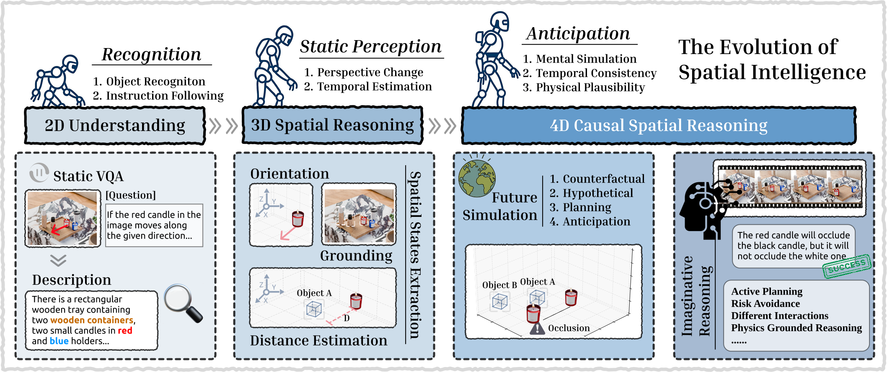
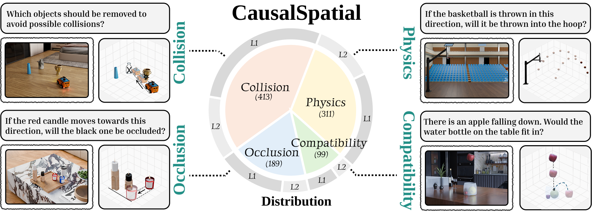

<div align="center">
<h1>CausalSpatial: A Comprehensive Benchmark for Object-Centric Causal Spatial Reasoning</h1>
<a href="https://arxiv.org/abs/2601.13304"></a>
<a href="https://huggingface.co/datasets/Mwxinnn/CausalSpatial"></a>
<br>
<br>
<strong>
<a href="https://mwxinnn.github.io/about/">Wenxin Ma<sup>1,2,*</sup></a>&nbsp;&nbsp;
<a href="https://lucky-wang-chenlong.github.io/">Chenlong Wang<sup>1,*</sup></a>&nbsp;&nbsp;
<a href="https://openreview.net/profile?id=~Ruisheng_Yuan2">Ruisheng Yuan<sup>1,*</sup></a>&nbsp;&nbsp;
<a href="https://openreview.net/profile?id=~Hao_Chen112">Hao Chen<sup>1</sup></a>&nbsp;&nbsp;
<a href="https://openreview.net/profile?id=~Nanru_Dai1">Nanru Dai<sup>1</sup></a>&nbsp;&nbsp;
<br>
<a href="https://yijun-yang.github.io/">Yijun Yang<sup>3</sup></a>&nbsp;&nbsp;
<a href="https://scholar.google.com/citations?user=8eNm2GMAAAAJ&hl=en">S. Kevin Zhou<sup>2</sup></a>&nbsp;&nbsp;
<a href="https://www.cs.jhu.edu/~ayuille/">Alan Yuille<sup>1</sup></a>&nbsp;&nbsp;
<a href="https://beckschen.github.io/">Jieneng Chen<sup>1,†</sup></a>&nbsp;&nbsp;
<br>
<br>
<sup>1</sup> Johns Hopkins University &nbsp;&nbsp;
<sup>2</sup> USTC &nbsp;&nbsp;
<sup>3</sup> HKUST
</strong>
</div> 

---

<!--  -->

We introduce ***CausalSpatial***, the first-of-this-kind diagnostic benchmark designed to evaluate the capability of **Causal Spatial Reasoning**.

- What is the **Causal Spatial Reasoning**?

  For human intelligence, it can naturally imagine a mental 3D model of the world to simulate physical interactions and predict potential outcomes, presenting a high-level combination of spatial understanding and causal reasoning.

- ***CausalSpatial*** Design.

  It adopts an **object-centric** formulation: each query is grounded in a specific hypothetical motion applied to a target object within the image.
  This setup probes whether models can simulate the consequences of instance-level dynamics across four anticipation tasks: collision, compatibility, occlusion, and trajectory.



---

## :memo: Contents

- [:memo: Contents](#memo-contents)
- [💡 Updates \& News](#-updates--news)
- [💾 Environment](#-environment)
- [🚀 Evaluation](#-evaluation)
- [📂 VLMEvalKit](#-vlmevalkit)
- [⚠️ TODO List](#️-todo-list)
- [👍 Acknowledgement](#-acknowledgement)
- [⭐ Citation](#⭐-citation)

## 💡 Updates & News
- [2026/1] Our paper has been released on Arxiv. Our dataset will be released soon.

## 💾 Environment

1. **Submodules**
```cli
git submodule add https://github.com/facebookresearch/map-anything.git ./sub_module/map_anything
git submodule add https://github.com/bytedance/ATI.git ./sub_module/ati
```

2. **Environment**
```cli
pip install -r requirements.txt
```

3. **Download ATI Model**
```cli
huggingface-cli download Wan-AI/Wan2.1-I2V-14B-480P --local-dir ./Wan2.1-I2V-14B-480P
huggingface-cli download bytedance-research/ATI --local-dir ./Wan2.1-ATI-14B-480P

cp ./Wan2.1-I2V-14B-480P/Wan2.1_VAE.pth ./Wan2.1-ATI-14B-480P/
cp ./Wan2.1-I2V-14B-480P/models_t5_umt5-xxl-enc-bf16.pth ./Wan2.1-ATI-14B-480P/
cp ./Wan2.1-I2V-14B-480P/models_clip_open-clip-xlm-roberta-large-vit-huge-14.pth ./Wan2.1-ATI-14B-480P/
cp -r ./Wan2.1-I2V-14B-480P/xlm-roberta-large ./Wan2.1-ATI-14B-480P/
cp -r ./Wan2.1-I2V-14B-480P/google ./Wan2.1-ATI-14B-480P/
```

## 🚀 Evaluation

1. **Load Dataset**
  ```python
  from datasets import load_dataset

  repo_id = "Mwxinnn/CausalSpatial"
  dataset = load_dataset(repo_id, "collision", split="train") # Load collision subset
  ```

2. **Evaluate MLLMs on CausalSpatial**

  Optional models: 
  - GPT5 / GPT-5 mini / Claude / Gemini / Qwen2.5 VL / Qwem3-VL
  ```cli
  python eval.py --model_path GPT5 --output_file ./output-gpt5 --subset collision+physics
  ```

3. **Inference COW**

  Note that, COW requires two gpus (80G) for generation. One is for trajectory prediction, the other is for video generation.
  ```python
  from pipeline import COW

  # Prepare COW instance
  cow = COW(
      frame_num=60,                                   # frame number of generated video
      delta_t=3 * (1.0 / 30.0),                       # time interval between frames
      model="Qwen/Qwen3-VL-30B-A3B-Instruct",         # MLLM model
      map_anything_model="facebook/map-anything",
      debug=True                                      # visualize the trajectory when set True
  )

  output_dict = cow(
      prompt,             # question prompt in CausalSpatial
      save_dir,           
      image_a_path,       # question image in CausalSpatial
      generate=True,
  )

  print(output["save"])               # output directory
  print(output["object"])             # target object description
  print(output["rewrite_prompt"])     # rewrite prompt
  ```

4. **Evaluate MLLMs with COW on CausalSpatial**

  We highly recommend to first inference COW to generate videos and then evaluate MLLMs on the generated videos.

  - Inference COW on CausalSpatial
  ```cli
  # Prepare 2 gpus for generation
  python pipeline.py --output_dir ./output --subset collision+physics

  # If 8 gpus for inference
  torchrun --nproc_per_node=4 pipeline.py --output_dir ./output --subset collision
  ```

  - Evaluate MLLMs with COW Outputs
  ```cli
  python eval.py \
    --model_path GPT5 \
    --output_file ./output-gpt5 \
    --subset collision+physics \
    --COW                             # Set for evaluation with COW
    --COW_output ./output             # Directory where the COW outputs are saved
    --video_frame 1+3+5                 # Select target frames of generated video
  ```

## 📂 VLMEvalKit

1. Download TSV file
  ```python
  import pandas as pd
  from huggingface_hub import hf_hub_download

  file_path = hf_hub_download(
      repo_id="Mwxinnn/CausalSpatial",
      filename="VLMEvalKit/CausalSpatial.tsv",
      repo_type="dataset"
  )

  df = pd.read_csv(file_path, sep='\t')
  print(df.head())
  ```

## ⚠️ TODO List
- [ ] Adaptation to VLMEvalKit
- [ ] COW inference for parabolic motion
- [x] Dataset Release
- [x] Paper Release

## 👍 Acknowledgement
Many thanks to all coauthors for their invaluable effort in this project!

We also thank these great projects:
- [MapAnything](https://github.com/facebookresearch/map-anything) is a simple, end-to-end trained transformer model that directly regresses the factored metric 3D geometry of a scene given various types of inputs (images, calibration, poses, or depth). 
- [ATI](https://github.com/bytedance/ATI) a trajectory-based motion control framework that unifies object, local and camera movements in video generation. 


## ⭐ Citation

```
@article{ma2025causalspatial,
  title={CausalSpatial: A Comprehensive Benchmark for Object-Centric Causal Spatial Reasoning},
  author={Ma, Wenxin and Wang, Chenlong and Yuan, Ruisheng and Chen, Hao and Dai, Nanru and Zhou, S. Kevin and Yang, Yijun and Yuille, Alan and Chen, Jieneng},
  journal={arXiv preprint arXiv:2601.13304},
  year={2026}
}
```
